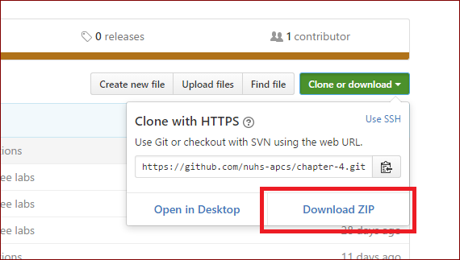
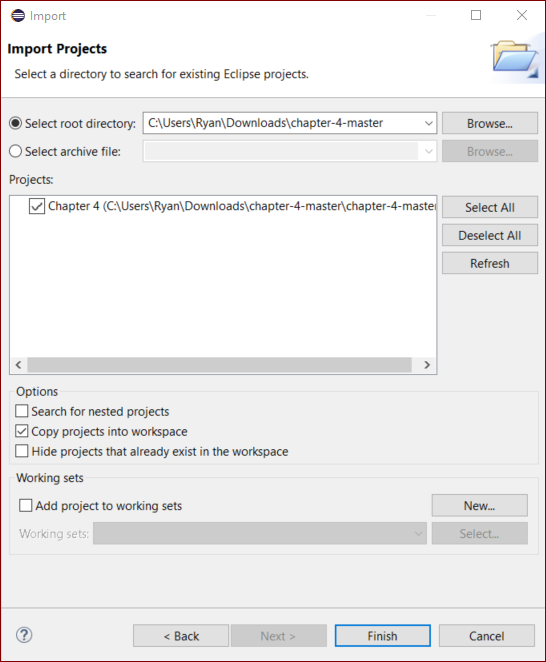

# Chapter 1 Lab Manual

Exercises 1-4 are adapted from similar lab assignments found at https://github.com/orhs-apcs/chapter-1 

## Getting Started

Here are a few steps to help you get started with these labs in Eclipse.

1. Download the files by clicking on the green "Clone or download" button and select "Download ZIP" from the dropdown.

   

2. Use the File Explorer to navigate to the downloaded file (likely in the Downloads folder), right-click on it, and select "Extract All..." In the new window, press the "Extract" button.

3. If you have not already, open up Eclipse and select your workspace like usual.

4. Under the File menu, select the "Import..." option. In the Import window, select the "Existing Projects into Workspace" from under the General tab and click Next.

5. In the next window, click "Browse..." and select the extracted folder from step 2.

6. Now, mark the checkbox next to the Chapter 4 **and** the checkbox next to "Copy projects into workspace" in the Options section.

   

7. Click Finish and you're done!

## Labs

1. Hello World
2. Poem
3. Comments
4. Problems

## Hello World

1. Create a new Java class using the `File > New > Class` menu item.

2. Name the class `HelloWorld`.

3. Type the following program:

   ```java
   public class HelloWorld {
       public static void main(String[] args) {
           System.out.println("Hello, world!");
       }
   }
   ```

4. Compile and run the program (click the green play button on the toolbar) and see what it does.

When you make syntax errors in your program the compiler gives and error message and doesn't create the bytecode file. Usually, the syntax error given by the compiler has basic information that you can use to locate and fix the first error in the program. In the second part of this exercise, you'll introduce some common errors into the program and examine the resulting error messages. If necessary, respond to any questions on a separate piece of paper. Also, reverse the changes made in each task below before moving on to the next.

5. Delete one letter from the name of the class, save the program, and recompile it. What is the error message?
6. Delete one letter from the 'Hello' in the message to be printed (inside the quotation marks). Save the program and recompile it. Is there an error message? Why or why not? What has changed?
7. Delete the ending quotation mark enclosing the string `"Hello, world!"`. Save the program and recompile it. What error message(s) do you get?
8. Now remove the beginning quotation mark? How many errors are there this time?  Often, when there are multiple quotations marks, fixing the first one will fix the rest. 
9. Remove the semicolon at the end of the line that prints the message. Save the program and recompile it. What error message(s) do you get?

## Poem

Write a program called `Poem.java` that prints the message `"Roses are red"`. Your program will need to include a class definition and a `main` method (try and see if you can remember it by yourself). Recall the following:

* The name of the class must match the name of the file without the extension
* The `main` method must be inside the class definition (inside the curly braces)
* The statement that prints the message must be inside the `main` method.

Run the program. Once you get it working, modify it so that it prints the entire poem:

```
Roses are red
Violets are blue
Sugar is sweet
And so are you!
```

## Comments

Open the `Count.java` file and modify it as follows (again, write answers to the questions as necessary):

1. Use `//` style comments to add a comment header at the top of the file that includes the name of the program, your name, and a brief description of what the program does.
2. Add a comment before each `println` that indicates the language in the next line.
3. Remove one of the slashes from one of your comment lines and run the program.  What error do you get? Put the slash back in.
4. Try putting a comment within a comment so that a `//` appears after the initial `//` on a comment line. Does this cause problems?

## Problems

The file `Problems.java` contains a simple program with a number of syntax errors. Correct them all until the program runs correctly.
